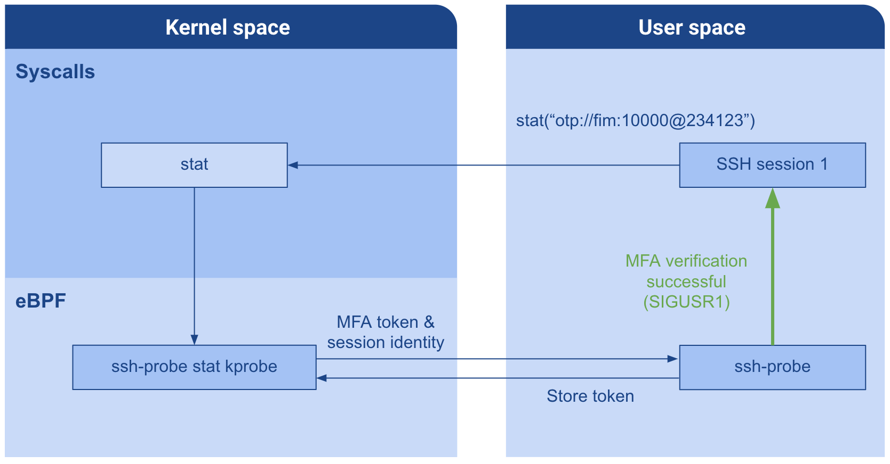

## SSH Probe

ssh-probe helps monitor and protect SSH sessions. Relying on predefined security profiles for each user, ssh-probe introduces a new access control layer that can restrict what a user can do on a server, including the root user. On a technical standpoint, ssh-probe relies on eBPF to collect runtime data on up to 127 hook points in the kernel. When an action diverges from the security profile of a session, ssh-probe relies on its syscall hook points to grant or deny access to specific operations. Access can also be granted through an MFA verification.

Monitoring and enforcement are organized in categories:

- File integrity monitoring: defines a list of files that should be monitored.
- Process monitoring: defines a list of binaries that should be monitored.
- Process level protections: includes protections against process injection techniques, etc.
- Privilege elevation: covers the system calls used to change the credentials of a process.
- OS level protections: includes protections for the kernel and prevents the modification of sensitive parameters, etc.
- Socket creation: grants or denies socket creation, this category is used to control if the processes of a session should have access to the network (doesn't affect the sshd daemon).
- Kill: isolates the kill system calls so that you can grant access to them for a short period of time.
- Performance monitoring: isolates the system calls required for performance monitoring so that you can grant access to them for a short period of time.

For each category (and each file for FIM and process monitoring), 4 options are available to define how ssh-probe should react:

- `allow`: ssh-probe will allow the operation to go through.
- `block`: ssh-probe will block the operation, no matter what Linux's "normal" access control decided. This essentially means that it will block a standard user as well as a privileged user.
- `mfa`: an MFA verification for the requested category (called `scope`) is required for ssh-probe to grant access to the operation
- `kill`: ssh-probe will block access to the operation and kill the SSH session that is responsible for trying to execute it

You can find a profile example in [profiles/vagrant.yaml](profiles/vagrant.yaml).

### Getting started

This project includes 3 binaries:

- `ssh-probe` is the main executable of the project, it is responsible for loading eBPF programs and maps into the kernel, loading profiles in the kernel and collecting security alerts (and forwarding them to the Datadog agent if you configured it).
- `ssh-probe-auth` is used for MFA verification. If you configured your profiles to use MFA, you should make sure that this binary is allowed in your profile.
- `ssh-probe-register` is used to generate new MFA secrets so that you can register a new app to work with `ssh-probe`. The output of the binary is a QR code that you can scan with your MFA app, and a secret token for the newly registered user, that you need to share with `ssh-probe` using the `SSH_PROBE_SECRETS` environment variable.

#### System requirements

- golang 1.13+
- This project was developed on an Ubuntu Focal machine (Linux Kernel 5.4) but should be compatible with 4.13+ kernels (not tested).
- Kernel headers are expected to be installed in `lib/modules/$(uname -r)`, update the `Makefile` with their location otherwise.
- clang & llvm (developed with 11.0.1)

#### Build

1) If you need to rebuild the eBPF programs, use the following command:

```shell script
# ~ make build-ebpf
```

2) To build ssh-probe, ssh-probe-auth and ssh-probe-register, run:

```shell script
# ~ make build
```

3) To install ssh-probe (copy all 3 binaries to /usr/bin/) run:
```shell script
# ~ make install
```

### Using the default example profile

[profiles/vagrant.yaml](profiles/vagrant.yaml) contains the default security profiles for the `vagrant` and `root` users. Those profiles were written to showcase the different capabilities of ssh-probe and can be used as a starting point to write new ones.

1) Write a security profile for the user you wish to protect. If you use the default profiles, don't forget to edit the username as needed.

2) (optionnal) In order to use the MFA feature of ssh-probe, you need to link ssh-probe with your One-Time Password (OTP) application (like Google Authenticator or Duo Mobile). Use `ssh-probe-register` to generate a new secret token for each user you wish to protect. `ssh-probe-register` will generate a QR code that can be used to configure your OTP app with ssh-probe.

```shell script
# ~ ssh-probe-register -h
ssh-probe-register is used to generate MFA secrets and QR codes so that you can configure an OTP app with ssh-probe.

Usage:
  ssh-probe-register [flags]

Flags:
  -h, --help            help for ssh-probe-register
  -o, --output string   Output .png file for the QR code image. (default "/tmp/qr.png")
  -u, --user string     Username for which the secret is being generated.
  
# ~ ssh-probe-register --user my_user --output /tmp/qr.png
INFO[2021-03-16T14:25:11Z] new secret generated for "my_user": [212 20 117 31 107 37 205 35 233 97] (base32: 2QKHKH3LEXGSH2LB)
INFO[2021-03-16T14:25:11Z] export the following environment variable to ssh-probe (comma separated list): SSH_PROBE_SECRETS="my_user:2QKHKH3LEXGSH2LB"
INFO[2021-03-16T14:25:11Z] MFA URL: otpauth://totp/SSHProbe:my_user@ssh-probe.com?issuer=SSHProbe&secret=2QKHKH3LEXGSH2LB
INFO[2021-03-16T14:25:11Z] QR code was generated in /tmp/qr.png. Please scan it into MFA app.
```

3) (optionnal) Start the Datadog Agent with the following command:

```shell script
# ~ export DD_API_KEY=[your_api_key]
# ~ docker-compose up
```

4) To start `ssh-probe`, run the following command:
```shell script
# ~ ssh-probe -h
ssh-probe is a ssh session tracker based on eBPF, that can be used to mitigate the impact of stolen credentials. ssh-probe relies on eBPF to track ssh sessions at runtime.

Usage:
  ssh-probe [flags]

Flags:
  -a, --access-control-events-level string   defines the access control events level that should be reported to Datadog, available options are: allow, block, mfa, kill (default "mfa")
  -u, --agent-url string                     Datadog agent URL used to forward logs to Datadog
  -g, --disable-mfa-global-scope             Disable MFA tokens with global scope
  -h, --help                                 help for ssh-probe
  -l, --log-level string                     log level, options: panic, fatal, error, warn, info, debug or trace (default "info")
  -p, --profiles string                      path to the file containing the security profiles for each user

# ~ sudo --preserve-env=SSH_PROBE_SECRETS ./bin/ssh-probe --profiles ./profiles/vagrant.yaml --access-control-events-level allow --agent-url "127.0.0.1:10518"
INFO[2021-03-16T15:06:35Z] ssh-probe successfully started
```

5) ssh into your instance with one of the users for which you wrote a profile. The session will automatically be tracked and protected by ssh-probe according to the profile your provided (note that existing SSH sessions won't be tracked). In order to access a resource protected by MFA, you need to provide a one-time password to `ssh-probe-auth`. Once authentication is successful, you'll be able to perform the sensitive action within the provided time limit. Should you fail your MFA authentication too many times, your session will be immediately killed.

```shell script
# ~ ssh-probe-auth -h
ssh-probe-auth is used to authenticate your session with a one time password, in order to approve sensitive administrative operations.

Usage:
  ssh-probe-auth [flags]

Flags:
  -h, --help               help for ssh-probe-auth
  -s, --scope string       scope of the MFA access. Options are: fim, process_monitoring, unknown_binary, socket_creation, deletes_and_moves, privilege_elevation, os_level_protections, process_level_protections, performance_monitoring, kill, global. (default "global")
  -t, --timeout duration   MFA access timeout. Only values between 0 and 10m0s are allowed. (default 10s)

# ~ ssh-probe-auth -s process_monitoring -t 10s
INFO[2021-03-16T15:19:09Z] Enter your one time password (or q to quit):
592408
INFO[2021-03-16T15:19:17Z] Authentication successful (token expires in 10s)

# ~ // perform the sensitive action
```

### MFA verification with eBPF

In order to temporarily grant access to sensitive resources, we have implemented an MFA verification mechanism using eBPF. The reason why we used eBPF is twofold: first we have implemented the access control with eBPF, which means that our eBPF programs need to know if an access should be granted or not; second, we couldn't expose a local endpoint since the we wanted to enforce network access by blocking the creation of sockets (the local endpoint solution would have required sockets, thus forcing the profile to always grant network access for other resources to be protected with MFA).

In other words, we used eBPF to retrieve the MFA token from the `ssh-probe-auth` binary, without having to connect to a local endpoint. We decided to place a kprobe on the `stat` syscall, and use the file path provided to that syscall in order to push the one time password to kernel space. If our eBPF program recognizes the MFA declaration pattern in the path provided to `stat`, then the token, scope and timeout are parsed and sent to user space for verification. Once the token is accepted, `ssh-probe` pushes a temporary token to kernel space, so that our eBPF programs know which session should be granted temporary access to which resources. In the meantime, a signal is sent to `ssh-probe-auth` to let the user know that the MFA verification was successful (or not). Should the authentication fail too many times, the session is immediately killed.


